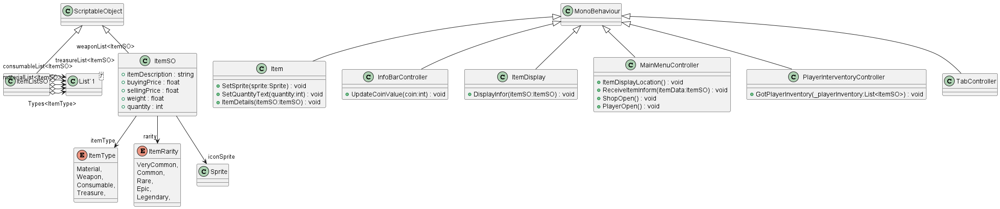

# Inventory and Shop
You have to create an Inventory and Shop Game mechanic as follows:
The Game Screen will be divided into 2 different UI Panels as shown below, each with a Grid UI: 900px

- [x] One Panel represents Shop and the other represents Player Inventory
- [x] Your current Currency will displayed on the top corner of the Screen
- [x] Initially, your player inventory will be empty and you will have no money
- [x] There will be many items in the shop that you can buy.
- [ ] Gathering Functionality.

-[x]
## Item 
Each item in the shop or inventory will have the following properties:
Type
Icon
Item description
Buying Price
Selling Price
Weight
Rarity
Quantity
-[x]
## Item Types

Items can be of the following types:
Materials
Weapons
Consumables
Treasure
The shop UI will have 4 tabs for each item type
Selecting a tab will display available items of that type in the shop.

- [x]
## Icon & Description
Each item will have a unique Icon and Text Description
Any of the Items in inventory or the shop when selected, its icon, description, value, weight, and any other details will be shown in UI 
The layout of your game screen can be designed and tweaked according to your preferences as long as all the features are implemented correctly.
- [ ]
## Gathering Resources
At the bottom, there should be a button to gather resources.
Initially, the player will have nothing in the inventory and no money as well.
The player can click the gather resource button and collect some random items.
The rarity of items gathered will be directly proportional to the cumulative value of the player’s inventory.
If the inventory’s weight offshoots the maximum weight that can be carried, the gathering resources button will not work and a popup will be shown to indicate the same to the player.

## PUML Class Diagram 

